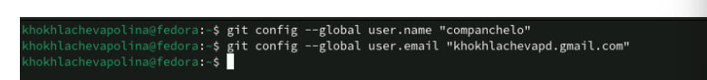
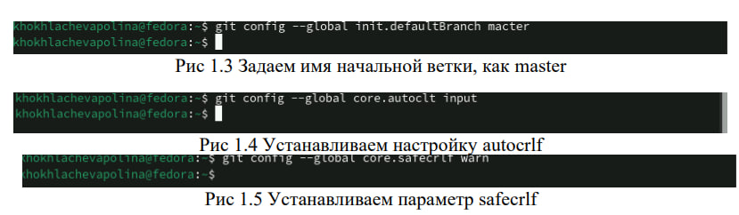
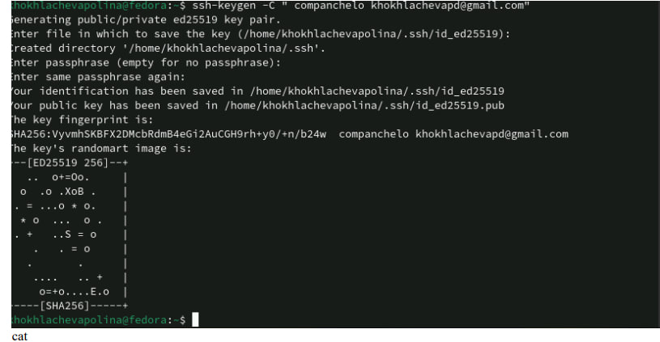
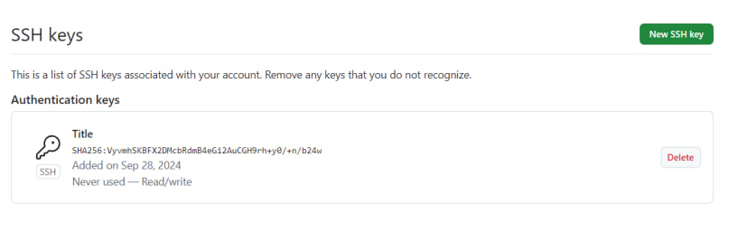
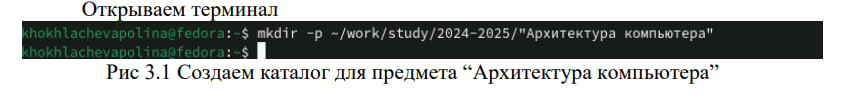
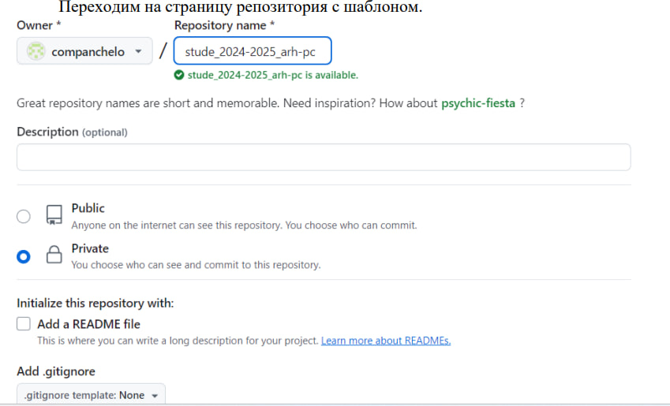

---
## Front matter
title: "Отчёта по лабораторной работе 2"
subtitle: "Система контроля версии Git"
author: "Хохлачёва Полина Дмитриевна"

## Generic otions
lang: ru-RU
toc-title: "Содержание"

## Bibliography
bibliography: bib/cite.bib
csl: pandoc/csl/gost-r-7-0-5-2008-numeric.csl

## Pdf output format
toc: true # Table of contents
toc-depth: 2
lof: true # List of figures
lot: true # List of tables
fontsize: 12pt
linestretch: 1.5
papersize: a4
documentclass: scrreprt
## I18n polyglossia
polyglossia-lang:
  name: russian
  options:
	- spelling=modern
	- babelshorthands=true
polyglossia-otherlangs:
  name: english
## I18n babel
babel-lang: russian
babel-otherlangs: english
## Fonts
mainfont: IBM Plex Serif
romanfont: IBM Plex Serif
sansfont: IBM Plex Sans
monofont: IBM Plex Mono
mathfont: STIX Two Math
mainfontoptions: Ligatures=Common,Ligatures=TeX,Scale=0.94
romanfontoptions: Ligatures=Common,Ligatures=TeX,Scale=0.94
sansfontoptions: Ligatures=Common,Ligatures=TeX,Scale=MatchLowercase,Scale=0.94
monofontoptions: Scale=MatchLowercase,Scale=0.94,FakeStretch=0.9
mathfontoptions:
## Biblatex
biblatex: true
biblio-style: "gost-numeric"
biblatexoptions:
  - parentracker=true
  - backend=biber
  - hyperref=auto
  - language=auto
  - autolang=other*
  - citestyle=gost-numeric
## Pandoc-crossref LaTeX customization
figureTitle: "Рис."
tableTitle: "Таблица"
listingTitle: "Листинг"
lofTitle: "Список иллюстраций"
lotTitle: "Список таблиц"
lolTitle: "Листинги"
## Misc options
indent: true
header-includes:
  - \usepackage{indentfirst}
  - \usepackage{float} # keep figures where there are in the text
  - \floatplacement{figure}{H} # keep figures where there are in the text
---

# Цель работы

Целью работы является изучить идеологию и применение средств 
контроля версий. Приобрести практические навыки по работе с системой 
gi
# Выполнение лабораторной работы

Делаем предварительную конфигурацию git.

{#fig:001 width=70%}

Настраиваем utf-8 в выводе сообщения git.

{#fig:002 width=70%}

Задаём имя начальной ветки.

{#fig:003 width=70%}

Создание SSH ключа

{#fig:004 width=70%}

Заходим в свой аккаунт на сайте github. Переходим в настройки

{#fig:005 width=70%}

Сознание рабочего пространства и репозитория курса на основе шаблона.

{#fig:006 width=70%}

Создание репозитория курса

{#fig:007 width=70%}

Настройка каталога курса.

{#fig:008 width=70%}

# Выводы

Мы изучили идеологию и применение средств контроля версий, , выучили команды
для работы с ним, создали свой репозиторий на платформе github,. Приобрели
практические навыки по работе с системой git

