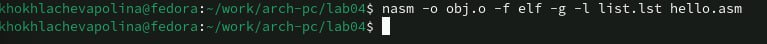
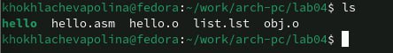

---
## Front matter
title: "Отчёт по лабораторной работе №4"
subtitle: "Создание и процесс
обработки программ на языке ассемблера NASM"
author: "Хохлачёва Полина Дмитриевна"

## Generic otions
lang: ru-RU
toc-title: "Содержание"

## Bibliography
bibliography: bib/cite.bib
csl: pandoc/csl/gost-r-7-0-5-2008-numeric.csl

## Pdf output format
toc: true # Table of contents
toc-depth: 2
lof: true # List of figures
fontsize: 12pt
linestretch: 1.5
papersize: a4
documentclass: scrreprt
## I18n polyglossia
polyglossia-lang:
  name: russian
  options:
	- spelling=modern
	- babelshorthands=true
polyglossia-otherlangs:
  name: english
## I18n babel
babel-lang: russian
babel-otherlangs: english
## Fonts
mainfont: IBM Plex Serif
romanfont: IBM Plex Serif
sansfont: IBM Plex Sans
monofont: IBM Plex Mono
mathfont: STIX Two Math
mainfontoptions: Ligatures=Common,Ligatures=TeX,Scale=0.94
romanfontoptions: Ligatures=Common,Ligatures=TeX,Scale=0.94
sansfontoptions: Ligatures=Common,Ligatures=TeX,Scale=MatchLowercase,Scale=0.94
monofontoptions: Scale=MatchLowercase,Scale=0.94,FakeStretch=0.9
mathfontoptions:
## Biblatex
biblatex: true
biblio-style: "gost-numeric"
biblatexoptions:
  - parentracker=true
  - backend=biber
  - hyperref=auto
  - language=auto
  - autolang=other*
  - citestyle=gost-numeric
## Pandoc-crossref LaTeX customization
figureTitle: "Рис."
tableTitle: "Таблица"
listingTitle: "Листинг"
lofTitle: "Список иллюстраций"
lolTitle: "Листинги"
## Misc options
indent: true
header-includes:
  - \usepackage{indentfirst}
  - \usepackage{float} # keep figures where there are in the text
  - \floatplacement{figure}{H} # keep figures where there are in the text
---

# Цель работы

Освоение процедуры компиляции и сборки программ, написанных на ассемблере NASM.

# Задание

Рассмотрим пример простой программы на языке ассемблера NASM. Традиционно первая
программа выводит приветственное сообщение Hello world! на экран.

# Выполнение лабораторной работы

Описываются проведённые действия, в качестве иллюстрации даётся ссылка на иллюстрацию (рис. [-@fig:001]).
Создайте каталог для работы с программами на языке ассемблера NASM

{#fig:001 width=70%}

Переходим в созданный каталог

{#fig:002 width=70%}

Создаём текстовый файл с именем hello.asm

{#fig:003 width=70%}

Открываем этот файл с помощью любого текстового редактора, например, gedit

{#fig:004 width=70%}

Преобразуем текст программы в объектный код

{#fig:005 width=70%}

Проверяем создался ли файл с помощью команды ls

{#fig:006 width=70%}

Скомпилируем исходный файл hello.asm в obj.o

{#fig:007 width=70%}

Проверяем работу команды

{#fig:008 width=70%}

Передаём объектный файл на обработку компоновщику
 
{#fig:009 width=70%}

Проверяем создание файла 

{#fig:0010 width=70%}

Передаём объектный файл на обработку компоновщику 

{#fig:0011 width=70%}

Проверяем создался ли файл hello

{#fig:0012 width=70%}

Запускаем на выполнение созданный исполняемый файл

{#fig:0013 width=70%}

Создаём копию файла hello.asm с именем lab4.asm

{#fig:0014 width=70%}

Открываем файл и редактируем его

{#fig:0015 width=70%}

{#fig:0016 width=70%}

Прописываем команды, как и в первой программе 

{#fig:0017 width=70%}

Копируем файлы 

{#fig:0018 width=70%}

# Выводы

Мы освоили процедуры компиляции и сборки программ, познакомились с языком NASM и создали две работающие программы 

::: {#refs}
:::
