---
## Front matter
title: "Отчёта по лабораторной работе №6"
subtitle: "Арифметические операции в NASM"
author: "Хохлачева Полина Дмитриевна"

## Generic otions
lang: ru-RU
toc-title: "Содержание"

## Bibliography
bibliography: bib/cite.bib
csl: pandoc/csl/gost-r-7-0-5-2008-numeric.csl

## Pdf output format
toc: true # Table of contents
toc-depth: 2
lof: true # List of figures
lot: true # List of tables
fontsize: 12pt
linestretch: 1.5
papersize: a4
documentclass: scrreprt
## I18n polyglossia
polyglossia-lang:
  name: russian
  options:
	- spelling=modern
	- babelshorthands=true
polyglossia-otherlangs:
  name: english
## I18n babel
babel-lang: russian
babel-otherlangs: english
## Fonts
mainfont: IBM Plex Serif
romanfont: IBM Plex Serif
sansfont: IBM Plex Sans
monofont: IBM Plex Mono
mathfont: STIX Two Math
mainfontoptions: Ligatures=Common,Ligatures=TeX,Scale=0.94
romanfontoptions: Ligatures=Common,Ligatures=TeX,Scale=0.94
sansfontoptions: Ligatures=Common,Ligatures=TeX,Scale=MatchLowercase,Scale=0.94
monofontoptions: Scale=MatchLowercase,Scale=0.94,FakeStretch=0.9
mathfontoptions:
## Biblatex
biblatex: true
biblio-style: "gost-numeric"
biblatexoptions:
  - parentracker=true
  - backend=biber
  - hyperref=auto
  - language=auto
  - autolang=other*
  - citestyle=gost-numeric
## Pandoc-crossref LaTeX customization
figureTitle: "Рис."
tableTitle: "Таблица"
listingTitle: "Листинг"
lofTitle: "Список иллюстраций"
lotTitle: "Список таблиц"
lolTitle: "Листинги"
## Misc options
indent: true
header-includes:
  - \usepackage{indentfirst}
  - \usepackage{float} # keep figures where there are in the text
  - \floatplacement{figure}{H} # keep figures where there are in the text
---

# Цель работы

Освоение арифметических инструкций языка ассемблера NASM.

# Выполнение лабораторной работы

Создаём каталог для программам лабораторной работы №6

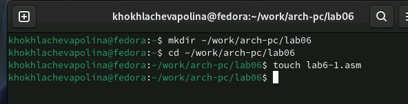{#fig:001 width=70%}

Открываем файл и заполняем в соответствие с листингом 

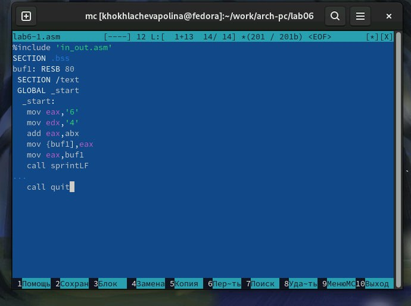{#fig:002 width=70%}

Создаём исполняемый файл и запускаем его 

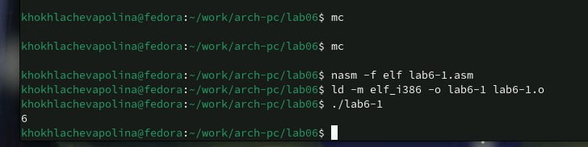{#fig:003 width=70%}

Открываем файл для редактирования

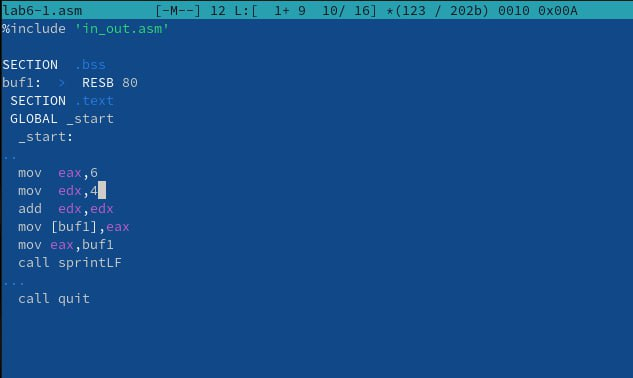{#fig:004 width=70%}

Создаём файл и запускаем его 

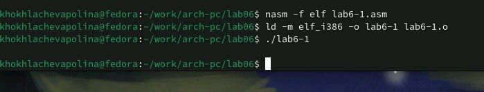{#fig:005 width=70%}

Создаём новый файл в каталоге 

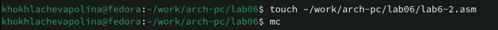{#fig:006 width=70%}

Заполняем файл в соответствие с листингом 

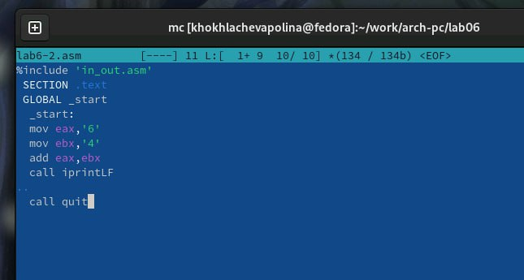{#fig:007 width=70%}

Создаём исполняемый файл и запускаем его

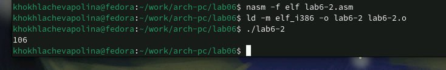{#fig:008 width=70%}

Открываем файл и редактируем его 

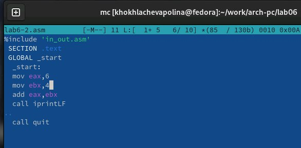{#fig:009 width=70%}

Создаём исполняемый файл и запускаем его 

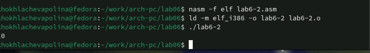{#fig:0010 width=70%}

Открываем файл и редактируем его

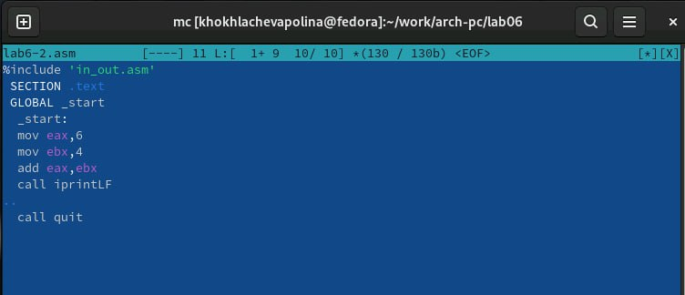{#fig:0011 width=70%}

Создаём исполняемый файл и запускаем его 

{#fig:0012 width=70%}

#Выполнение арифметических операций NASM

Создаём новый файл в каталоге 

{#fig:0013 width=70%}

Открываем файл и редактируем в соответствие с листингом

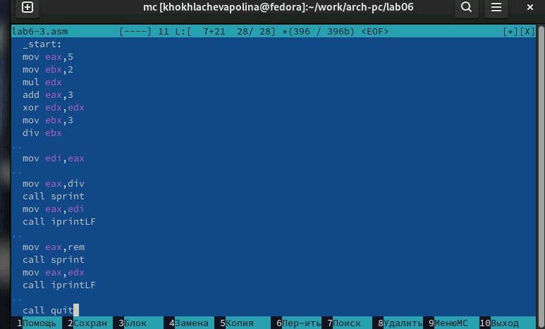{#fig:0014 width=70%}

Создаём исполняемый файл и запускаем его

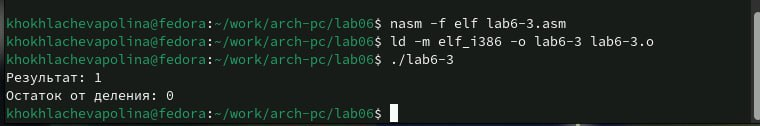{#fig:0015 width=70%}

Создаём файл для вычисления выражения 𝑓(𝑥) = (4 ∗ 6 + 2)/5. 

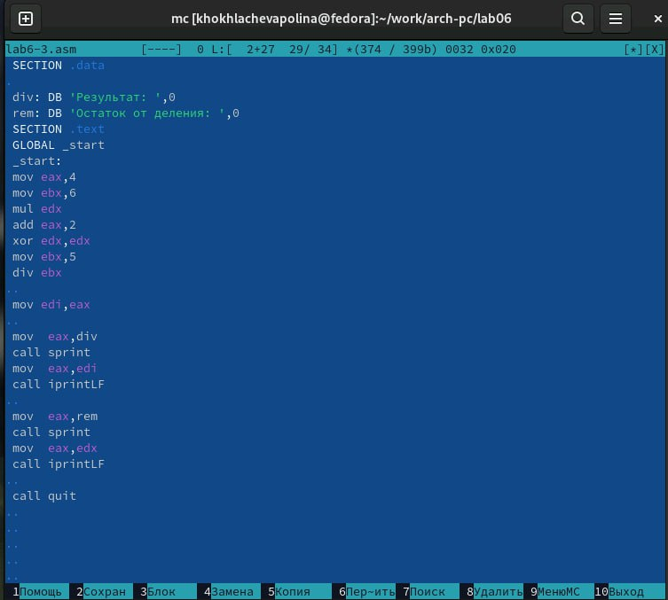{#fig:0016 width=70%}

Компилируем файл и запускаем программу

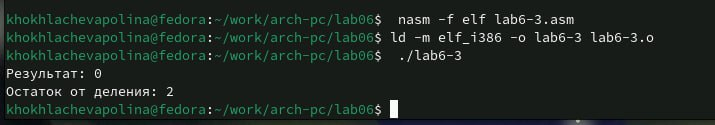{#fig:0017 width=70%}

Создаём новый файл в каталоге 

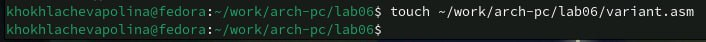{#fig:0018 width=70%}

Открываем файл и редактируем в соответствие с листингом

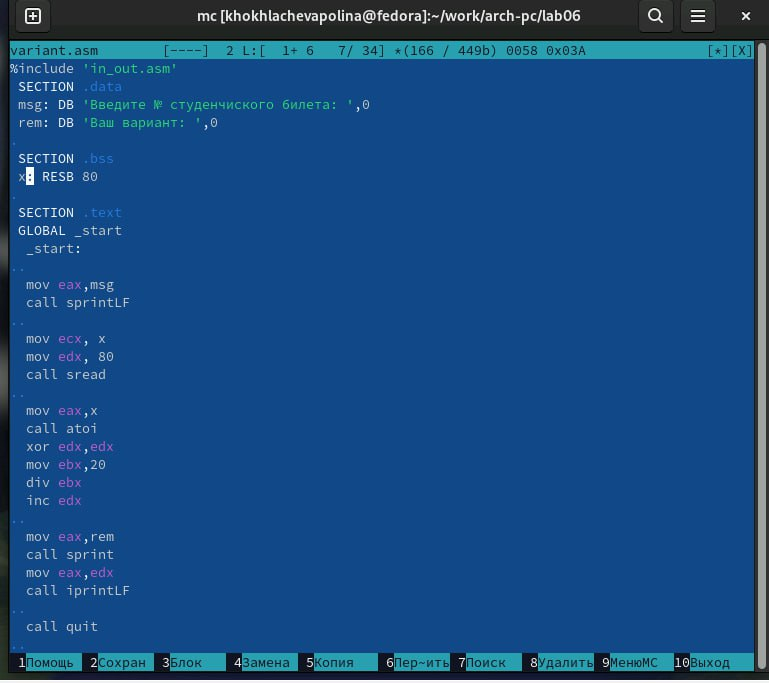{#fig:0019 width=70%}

Компилируем файл и запускаем его 

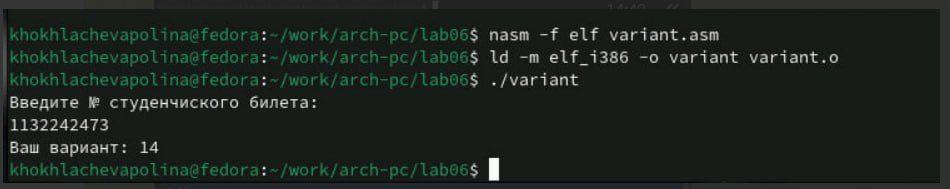{#fig:0020 width=70%}

# Ответы на вопросы по программе
1. Строка 'mov eax,msg' и 'call sprintLF'
2. Эти инструкции используются для считывания строки, введённой пользователем, и её сохранения в памяти по адресу x.
 • mov ecx, x — задаёт адрес для сохранения строки.
 • mov edx, 80 — задаёт максимальную длину считываемой строки.
 • call sread — вызывает процедуру чтения строки из стандартного ввода.
3. Инструкция call atoi используется для преобразования строки (ASCII-кодов), введённой пользователем, в число, которое будет сохранено в регистре eax.
4.xor edx, edx
mov ebx, 20
div ebx
inc edx
5. Остаток от деления записывается в регистр edx
6. Инструкция inc edx увеличивает значение в регистре edx на 1. В данном случае это используется для прибавления 1 к остатку от деления, чтобы получить номер варианта.
7. mov eax, rem
call sprint
mov eax, edx
call iprintLF

#Задание для самостоятельной работы 

Создаём новый файл в каталоге

{#fig:0021 width=70%}

Открываем его и заполняем, чтобы решалось выражение (x/2+8)*3

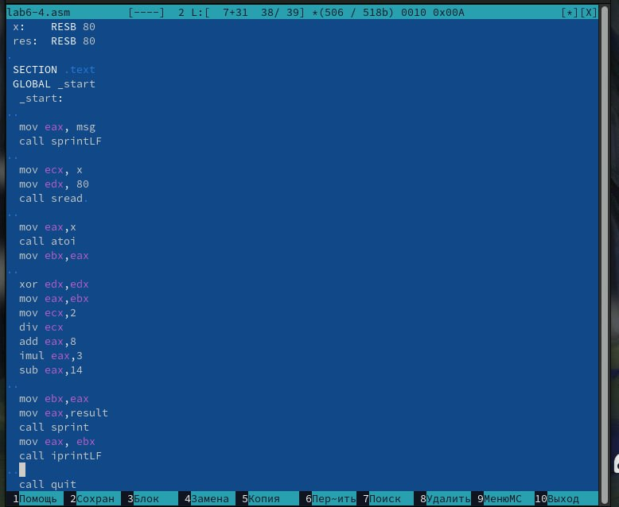{#fig:0022 width=70%}

Компилируем программу и проверяем для х=1

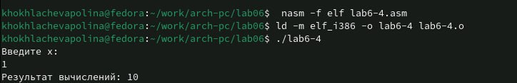{#fig:0023 width=70%}

Компилируем программу и проверяем для х=4

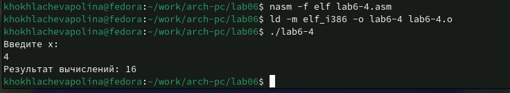{#fig:0024 width=70%}

 
# Выводы

Мы приобрели навыки создания исполнительный файлов для решения выражений и освоили арифметический инструкции 

# Список литературы{.unnumbered}

::: {#refs}
:::
