---
## Front matter
title: "Отчёта по лабораторной работе №3"
subtitle: "Команды безусловного и условного переходов в Nasm"
author: "Хохлачева Полина Дмитриевна"

## Generic otions
lang: ru-RU
toc-title: "Содержание"

## Bibliography
bibliography: bib/cite.bib
csl: pandoc/csl/gost-r-7-0-5-2008-numeric.csl

## Pdf output format
toc: true # Table of contents
toc-depth: 2
lof: true # List of figures
lot: true # List of tables
fontsize: 12pt
linestretch: 1.5
papersize: a4
documentclass: scrreprt
## I18n polyglossia
polyglossia-lang:
  name: russian
  options:
	- spelling=modern
	- babelshorthands=true
polyglossia-otherlangs:
  name: english
## I18n babel
babel-lang: russian
babel-otherlangs: english
## Fonts
mainfont: IBM Plex Serif
romanfont: IBM Plex Serif
sansfont: IBM Plex Sans
monofont: IBM Plex Mono
mathfont: STIX Two Math
mainfontoptions: Ligatures=Common,Ligatures=TeX,Scale=0.94
romanfontoptions: Ligatures=Common,Ligatures=TeX,Scale=0.94
sansfontoptions: Ligatures=Common,Ligatures=TeX,Scale=MatchLowercase,Scale=0.94
monofontoptions: Scale=MatchLowercase,Scale=0.94,FakeStretch=0.9
mathfontoptions:
## Biblatex
biblatex: true
biblio-style: "gost-numeric"
biblatexoptions:
  - parentracker=true
  - backend=biber
  - hyperref=auto
  - language=auto
  - autolang=other*
  - citestyle=gost-numeric
## Pandoc-crossref LaTeX customization
figureTitle: "Рис."
tableTitle: "Таблица"
listingTitle: "Листинг"
lofTitle: "Список иллюстраций"
lotTitle: "Список таблиц"
lolTitle: "Листинги"
## Misc options
indent: true
header-includes:
  - \usepackage{indentfirst}
  - \usepackage{float} # keep figures where there are in the text
  - \floatplacement{figure}{H} # keep figures where there are in the text
---

# Цель работы

Изучение команд условного и безусловного переходов. Приобретение навыков написания
программ с использованием переходов. Знакомство с назначением и структурой файла
листинга

 
# Выполнение лабораторной работы

Создаём каталог и в нём создаём файл

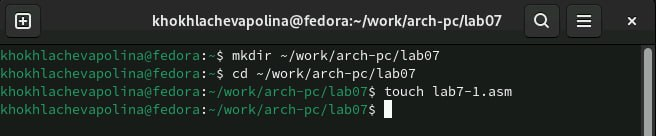{#fig:001 width=70%}

Открываем файл и заполняем его в соответствии с листингом

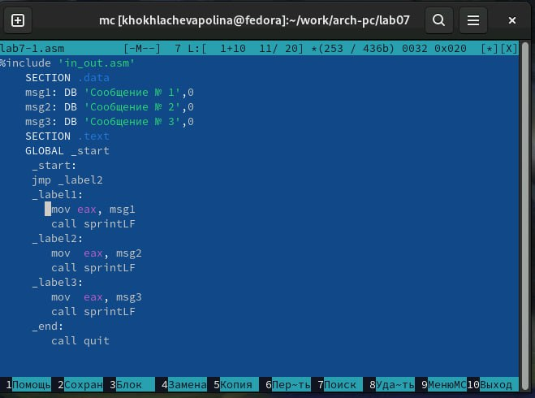{#fig:002 width=70%}

Создаём файл и запускаем его

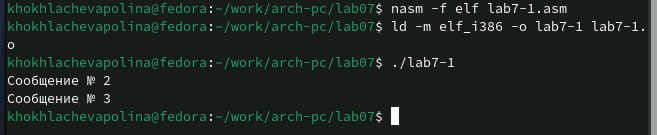{#fig:003 width=70%}

Открываем файл и редактируем его в соответствии с листингом 

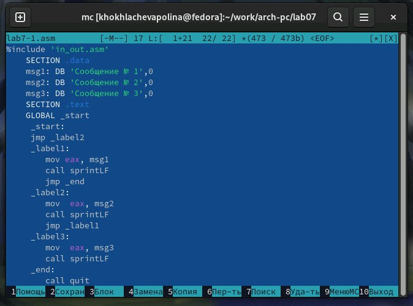{#fig:004 width=70%}

Создаём файл и запускаем его

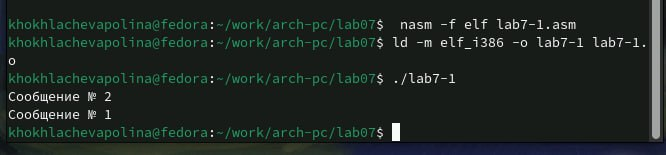{#fig:005 width=70%}

Открываем файл и редактируем его

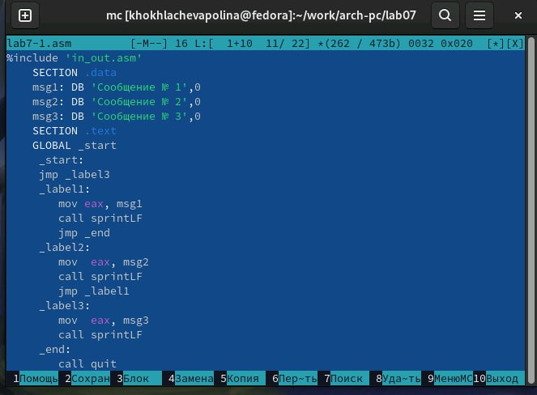{#fig:006 width=70%}

Создаём файл и запускаем его

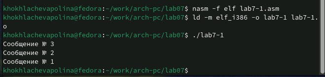{#fig:007 width=70%}

Создаём новый файл

{#fig:008 width=70%}

Открываем файл и заполняем в соответствие с листингом 

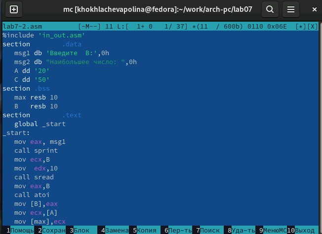{#fig:009 width=70%}

Создаём файл проверяем работу 

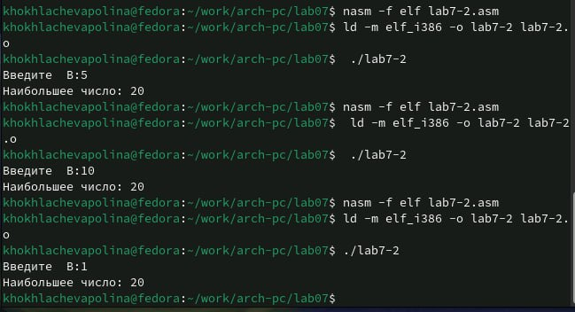{#fig:0010 width=70%}

Создаём файл

{#fig:0011 width=70%}

Открываем файл и изучаем его

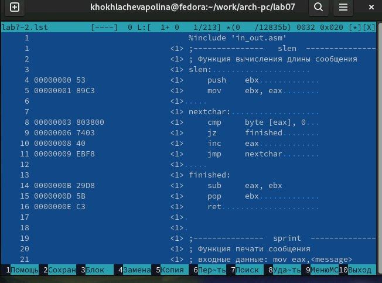{#fig:0012 width=70%}

Строка 33: 0000001D-адрес в сегменте кода, BB1000000-машинный код, mov ebx, 1-присвоение переменной  ecx 1.
Строка 34: 00000022-адрес в сегменте кода, B804000000-машинный код,mov eax,4-присвоение переменной eax значение 4.
Строка 3500000027-адрес в сегменте кода,CD80-машинный код, int 80h-вызов ядра

Открываем файл и удаляем один операндум 

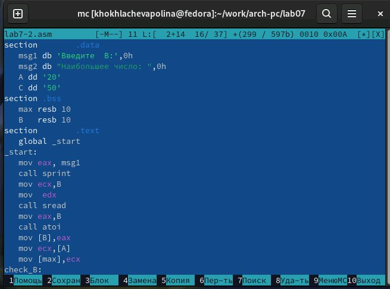{#fig:0013 width=70%}

Транслируем с получение файла листинга 

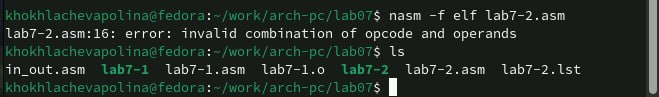{#fig:0014 width=70%}

Выдаётся ошибка, но создаются исполнительные файлы lab7-2 и  lab7-2.lst

Открываем файл и изучаем его

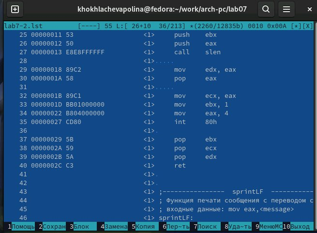{#fig:0015 width=70%}

#Задание для самостоятельной работы

Напишите программу нахождения наименьшей из 3 целочисленных переменных 𝑎,𝑏 и .
Значения переменных выбрать из табл. 7.5 в соответствии с вариантом, полученным
при выполнении лабораторной работы № 7. Создайте исполняемый файл и проверьте
его работу

Создаём новый файл

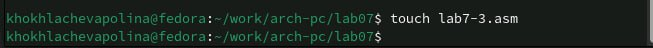{#fig:0016 width=70%}

Открываем файл и пишем программу для решения задачи

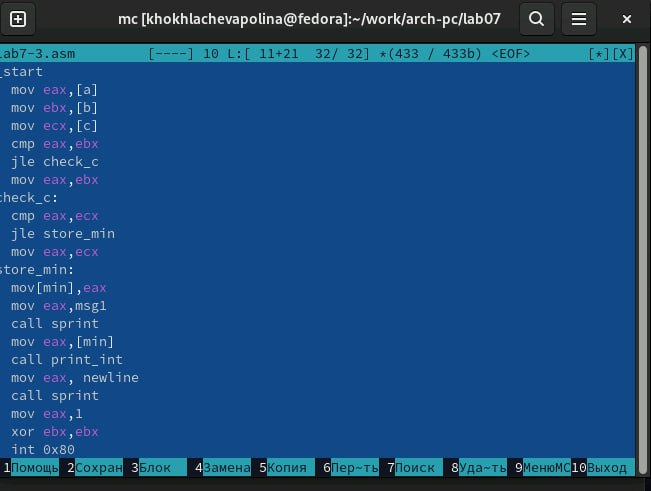{#fig:0017 width=70%}

Напишите программу, которая для введенных с клавиатуры значений 𝑥 и 𝑎 вычисляет
значение заданной функции 𝑓(𝑥) и выводит результат вычислений. Вид функции 𝑓(𝑥)
выбрать из таблицы 7.6 вариантов заданий в соответствии с вариантом, полученным
при выполнении лабораторной работы № 7. Создайте исполняемый файл и проверьте
его работу для значений 𝑥 и 𝑎 из 7.6

Создаём новый файл

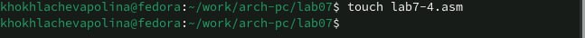{#fig:0018 width=70%}

Открываем его и пишем программу для решения задачи

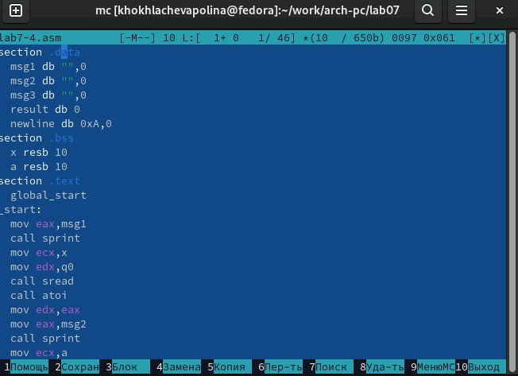{#fig:0019 width=70%}

# Выводы

Мы познакомились с структурой файла листинга, освоили условного и безусловного перехода.

