---
## Front matter
title: "Отчёта по лабораторной работе №8"
subtitle: "Программирование цикла. Обработка аргументов командной строки.
"
author: "Хохлачева Полина Дмитриевна"

## Generic otions
lang: ru-RU
toc-title: "Содержание"

## Bibliography
bibliography: bib/cite.bib
csl: pandoc/csl/gost-r-7-0-5-2008-numeric.csl

## Pdf output format
toc: true # Table of contents
toc-depth: 2
lof: true # List of figures
lot: true # List of tables
fontsize: 12pt
linestretch: 1.5
papersize: a4
documentclass: scrreprt
## I18n polyglossia
polyglossia-lang:
  name: russian
  options:
	- spelling=modern
	- babelshorthands=true
polyglossia-otherlangs:
  name: english
## I18n babel
babel-lang: russian
babel-otherlangs: english
## Fonts
mainfont: IBM Plex Serif
romanfont: IBM Plex Serif
sansfont: IBM Plex Sans
monofont: IBM Plex Mono
mathfont: STIX Two Math
mainfontoptions: Ligatures=Common,Ligatures=TeX,Scale=0.94
romanfontoptions: Ligatures=Common,Ligatures=TeX,Scale=0.94
sansfontoptions: Ligatures=Common,Ligatures=TeX,Scale=MatchLowercase,Scale=0.94
monofontoptions: Scale=MatchLowercase,Scale=0.94,FakeStretch=0.9
mathfontoptions:
## Biblatex
biblatex: true
biblio-style: "gost-numeric"
biblatexoptions:
  - parentracker=true
  - backend=biber
  - hyperref=auto
  - language=auto
  - autolang=other*
  - citestyle=gost-numeric
## Pandoc-crossref LaTeX customization
figureTitle: "Рис."
tableTitle: "Таблица"
listingTitle: "Листинг"
lofTitle: "Список иллюстраций"
lotTitle: "Список таблиц"
lolTitle: "Листинги"
## Misc options
indent: true
header-includes:
  - \usepackage{indentfirst}
  - \usepackage{float} # keep figures where there are in the text
  - \floatplacement{figure}{H} # keep figures where there are in the text
---

# Цель работы
Приобретение навыков написания программ с использованием циклов и обработкой
аргументов командной строки.

 

# Выполнение лабораторной работы

Создаём каталог для лабораторной работы

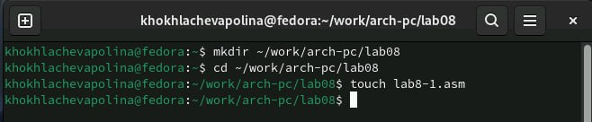{#fig:001 width=70%}

Открываем файл и заполняем его в соответствии с листингом 

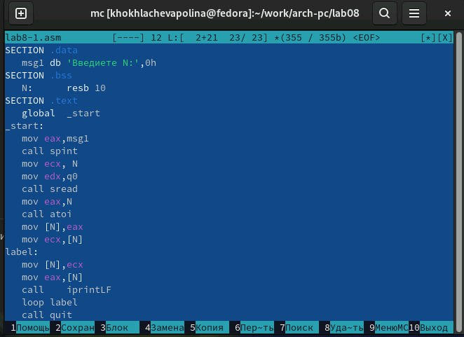{#fig:002 width=70%}

Создаём файл и запускаем его

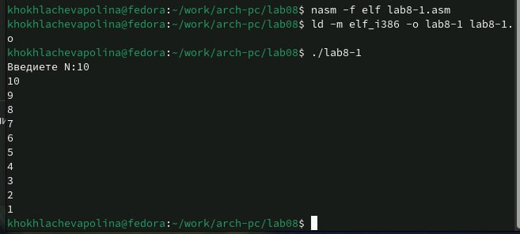{#fig:003 width=70%}

Открываем файл и редактируем его 

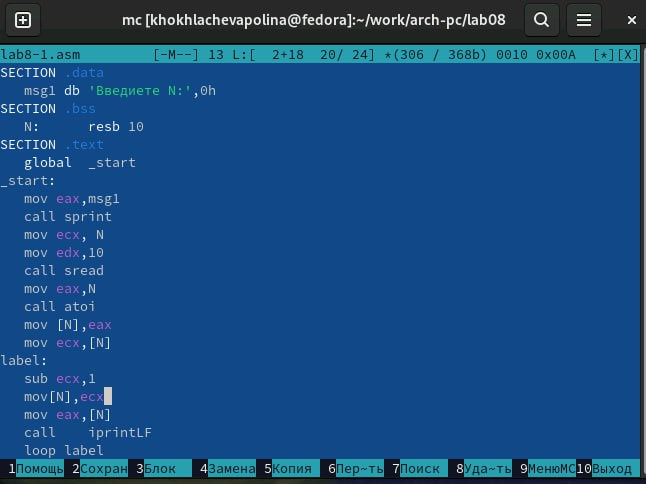{#fig:004 width=70%}

Создаём файл и запускаем его

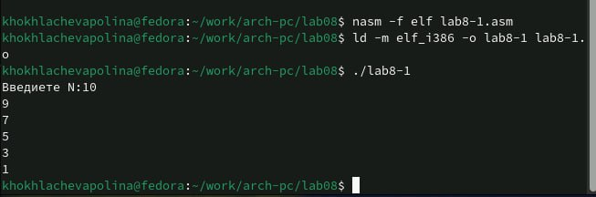{#fig:005 width=70%}

Редактируем файл

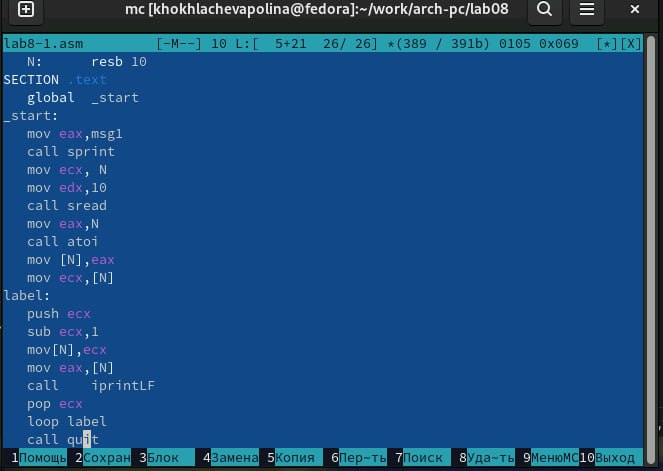{#fig:006 width=70%}

Создаём файл и запускаем его

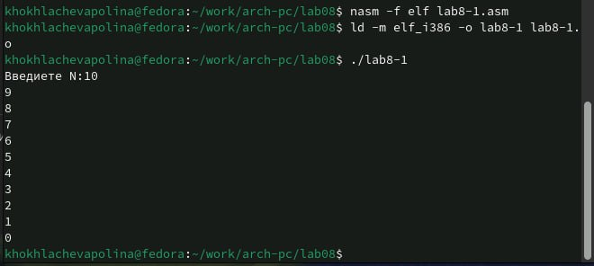{#fig:007 width=70%}

Создаём новый файл

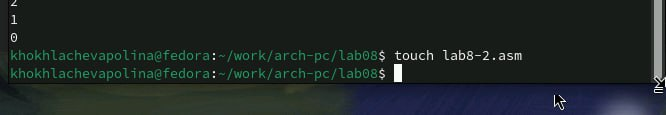{#fig:008 width=70%}

Открываем файл и заполняем его в соответствии с листингом

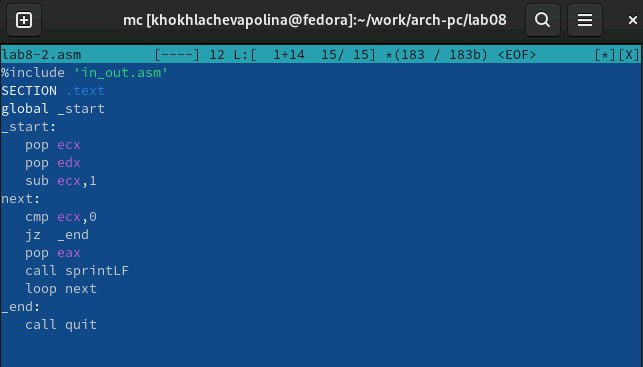{#fig:009 width=70%}

Создаём файл и проверяем его работу 

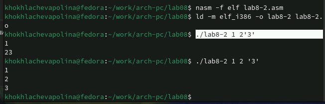{#fig:0010 width=70%}

Программой было обработано 3 аргумента

Создаём новый файл 

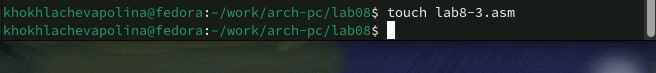{#fig:0011 width=70%}

Открываем файл и заполняем в соответсвие с листингом 

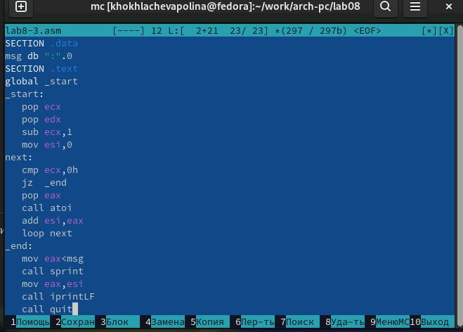{#fig:0012 width=70%}

Создаём файл и запускаем его

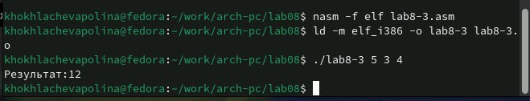{#fig:0013 width=70%}

Открываем файл и редактируем его

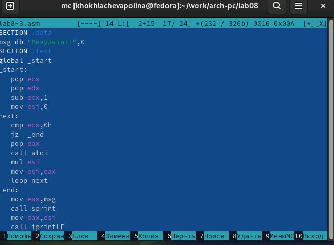{#fig:0014 width=70%}

Создаём файл и запускаем файл

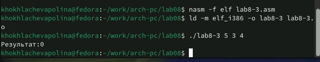{#fig:0015 width=70%}

 Задание для самостоятельной работы
 
1. Напишите программу, которая находит сумму значений функции 𝑓(𝑥) для
𝑥 = 𝑥1, 𝑥2, ..., 𝑥𝑛, т.е. программа должна выводить значение 𝑓(𝑥1) + 𝑓(𝑥2) + ... + 𝑓(𝑥𝑛).
Значения 𝑥𝑖 передаются как аргументы. Вид функции 𝑓(𝑥) выбрать из таблицы
8.1 вариантов заданий в соответствии с вариантом, полученным при выполнении
лабораторной работы № 7. Создайте исполняемый файл и проверьте его работу на
нескольких наборах 𝑥 = 𝑥1, 𝑥2, ..., 𝑥𝑛.

 7(𝑥 + 1)
 Создаём новый файл
 
{#fig:0016 width=70%}
 
Пишем программу для решения выражения 

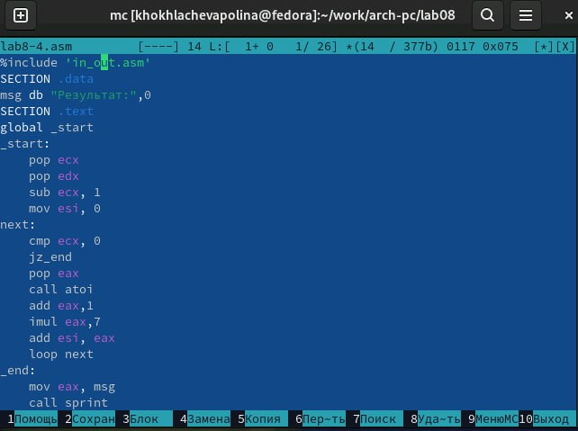{#fig:0017 width=70%}

# Выводы

Мы научились решать программы с использованием циклов и обработкой аргументов командной строки

