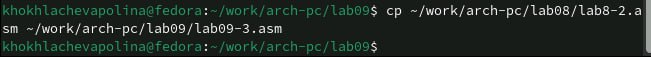

---
## Front matter
title: "Отчёта по лабораторной работе №9"
subtitle: " Понятие подпрограммы. Отладчик GDB."
author: "Хохлачёва Полина Дмитриевна"

## Generic otions
lang: ru-RU
toc-title: "Содержание"

## Bibliography
bibliography: bib/cite.bib
csl: pandoc/csl/gost-r-7-0-5-2008-numeric.csl

## Pdf output format
toc: true # Table of contents
toc-depth: 2
lof: true # List of figures
fontsize: 12pt
linestretch: 1.5
papersize: a4
documentclass: scrreprt
## I18n polyglossia
polyglossia-lang:
  name: russian
  options:
	- spelling=modern
	- babelshorthands=true
polyglossia-otherlangs:
  name: english
## I18n babel
babel-lang: russian
babel-otherlangs: english
## Fonts
mainfont: IBM Plex Serif
romanfont: IBM Plex Serif
sansfont: IBM Plex Sans
monofont: IBM Plex Mono
mathfont: STIX Two Math
mainfontoptions: Ligatures=Common,Ligatures=TeX,Scale=0.94
romanfontoptions: Ligatures=Common,Ligatures=TeX,Scale=0.94
sansfontoptions: Ligatures=Common,Ligatures=TeX,Scale=MatchLowercase,Scale=0.94
monofontoptions: Scale=MatchLowercase,Scale=0.94,FakeStretch=0.9
mathfontoptions:
## Biblatex
biblatex: true
biblio-style: "gost-numeric"
biblatexoptions:
  - parentracker=true
  - backend=biber
  - hyperref=auto
  - language=auto
  - autolang=other*
  - citestyle=gost-numeric
## Pandoc-crossref LaTeX customization
figureTitle: "Рис."
tableTitle: "Таблица"
listingTitle: "Листинг"
lofTitle: "Список иллюстраций"
lolTitle: "Листинги"
## Misc options
indent: true
header-includes:
  - \usepackage{indentfirst}
  - \usepackage{float} # keep figures where there are in the text
  - \floatplacement{figure}{H} # keep figures where there are in the text
---

# Цель работы

Приобретение навыков написания программ с использованием подпрограмм. Знакомство
с методами отладки при помощи GDB и его основными возможностями

# Выполнение лабораторной работы

Создаём новый каталог для лабораторной №9 

{#fig:001 width=70%}

Открываем файл и заполняем его в соответствие с листингом 

{#fig:002 width=70%}

Создаём файл и запускаем его

{#fig:003 width=70%}

Открываем файл для редактирования 

{#fig:004 width=70%}

Создаём файл и запускаем его 

{#fig:005 width=70%}

Создаём новый файл в каталоге

{#fig:006 width=70%}

Открываем файл и заполняем его в соответствии с листингом 

{#fig:007 width=70%}

Получаем исходный файл с использованием отладчика gdb

{#fig:008 width=70%}

Запускаем команду в отладчике 

{#fig:009 width=70%}

Устанавливаем брейкпоинт на метку _start и запускаем программу

{#fig:0010 width=70%}

Смотрим кол программы 

{#fig:0011 width=70%}

Переключаемся на отображение команд с Intelовским синтаксисом

{#fig:0012 width=70%}

Различия отображения синтаксиса машинных команд в режимах ATT и Intel:
1.Порядок операндов: В ATT синтаксисе порядок операндов обратный, сначала
указывается исходный операнд, а затем - результирующий операнд. В Intel син-
таксисе порядок обычно прямой, результирующий операнд указывается первым,
а исходный - вторым.
2.Разделители: В ATT синтаксисе разделители операндов - запятые. В Intel
синтаксисе разделители могут быть запятые или косые черты (/).
3.Префиксы размера операндов: В ATT синтаксисе размер операнда указывается перед операндом с использованием префиксов, таких как “b” (byte), “w” (word),
“l” (long) и “q” (quadword). В Intel синтаксисе размер операнда указывается после
операнда с использованием суффиксов, таких как “b”, “w”, “d” и “q”.
4.Знак операндов: В ATT синтаксисе операнды с позитивными значениями
предваряются символом “". "”.
5.Обозначение адресов: В ATT синтаксисе адреса указываются в круглых скоб-
ках. В Intel синтаксисе адреса указываются без скобок.
6.Обозначение регистров: В ATT синтаксисе обозначение регистра начинается
с символа “%”. В Intel синтаксисе обозначение регистра может начинаться с
символа “R” или “E” (например, “%eax” или “RAX”).

Включаем режим псевдографики

{#fig:0013 width=70%}

Проверяем установку точки основы и устанавливаем точку останова предпоследней инструкции

{#fig:0014 width=70%}

Посмотрим информацию о всех установленных точках останова

{#fig:0015 width=70%}

Выполняем 5 инструкций командой si

{#fig:0016 width=70%}

Во время выполнения команд менялись регистры: ebx, ecx, edx,eax, eip.

Смотрим значение переменной msg1 по имени 

{#fig:0017 width=70%}

Смотрим значение переменной 

{#fig:0018 width=70%}

Изменим первый символ

{#fig:0019 width=70%}

Изменим первый символ другой переменной

{#fig:0020 width=70%}

Смотрим значение в разных форматах

{#fig:0021 width=70%}

Изменяем регистор ebx

{#fig:0022 width=70%}

Выводится разные значения, так как команда без кавычек присваивает регистру вводимое значение.

Прописываем команды для завершения программы 

{#fig:0023 width=70%}

Копируем файл в файл

{#fig:0024 width=70%}

Создаём исполняемый файл и запускаем его 

{#fig:0025 width=70%}

Установим точку останова перед первой инструкцией в программе и запустим её

{#fig:0026 width=70%}

Смотрим позиции стека по разным адресам

{#fig:0027 width=70%}

Шаг изменения адреса равен 4 потому что адресные регистры имеют размер-
ность 32 бита(4 байта).

# Задание 1

Копируем файл в файл 

{#fig:0028 width=70%}

Открываем файл и меняем его 

{#fig:0029 width=70%}

Создаём Исполняемый файл и запускаем его

{#fig:0030 width=70%}

# Задание 2

Создаём новый файл в дирректории

{#fig:0031 width=70%}

Открываем файл и заполняем его в соответствие с листингом

{#fig:0032 width=70%}

Создаём исполняемый файл и запускаем его 

{#fig:0033 width=70%}

Создаём файл и смотрим на изменение решистров, ищем ошибку

Изменяем программу

{#fig:0034 width=70%}

Создаём файл и запускаем его 

{#fig:0035 width=70%}

# Выводы

Мы познакомились с методами отладки при помощи GDB и его возможностями.

